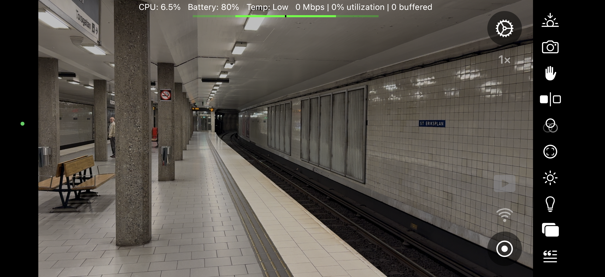

&nbsp;&nbsp;&nbsp;

# Tubeist

Tubeist is a native Swift 6 camera app for recording and streaming HDR video from an iPhone. It sends HEVC Main10 HLG video and AAC audio directly to YouTube over HLS, without an intermediate relay server. VideoToolbox and an AAC encoder feed MPEG-2 TS segments directly. When local recording is enabled, AVAssetWriter saves the same compressed samples as fragmented MP4 without another encode.

Tubeist is designed for events, sports, education, performances, and other long-form productions where image quality matters more than conversational latency. Watch [Tubeist demos on YouTube](https://youtube.com/playlist?list=PLFnkPgO2HxdAp_YiFVSWVpyak--0y6m5U&si=b2vjD-jVe0FY2egZ).

## Features

- Direct YouTube HLS delivery from the iPhone, with no relay server
- HEVC Main10 HLG video and AAC audio
- Record-only, stream-only, and simultaneous stream-and-record modes
- Fragmented MP4 local recordings using the original encoded media
- Built-in presets from 540p through 4K, subject to the selected camera's capabilities
- Manual focus, exposure, white balance, zoom, stabilization, and camera controls
- Local and external monitoring options
- Live bandwidth, buffer, CPU, battery, and thermal information
- Gradual bitrate reduction for sustained congestion, with a quality floor and prompt recovery
- Web overlays for graphics and live information
- Built-in image styles and effects
- Optional Google sign-in for YouTube broadcast discovery and management

## Installation

Tubeist is available on the [App Store](https://apps.apple.com/us/app/tubeist/id6740208994), and public builds are also distributed through [TestFlight](https://testflight.apple.com/join/atDHXHWy).

To build from source:

1. Clone this repository.
2. Open `Tubeist.xcodeproj` in Xcode 26 or later (CI uses Xcode 26.2).
3. Select your development team and a connected iPhone.
4. Build and run.

Tubeist requires iOS 18 or later and a physical iPhone with an HDR-capable capture format. The project has no external framework dependencies.

## Streaming to YouTube

The selected video bitrate is a ceiling. During sustained congestion, Tubeist
adjusts it at two-second segment boundaries and restores quality as soon as the
connection improves. Simultaneous recordings follow these bitrate changes;
recording-only sessions keep the selected bitrate. If bandwidth cannot support
the quality floor, the monitor warns that a lower-resolution preset is needed.
See the [controller design and offline validation](Tools/VideoToolboxProbe/README.md)
for tuning assumptions and limitations.

In Tubeist Settings, **Sign in with Google**, then choose **Create stream key**. Tubeist creates a reusable HLS stream and fills in the key. Set your title, visibility, audience, and other broadcast preferences, then Save. Your first broadcast is created and attached to the stream when you tap Start. New broadcast drafts default to private. Your YouTube channel must already be eligible and enabled for live streaming; Google account verification and channel activation cannot be performed through the streaming API.

You can also paste an existing **HLS** stream key. An RTMP or RTMPS key is not interchangeable with an HLS key. **Use a Tubeist stream key** switches the draft to the reusable key Tubeist created for the signed-in account, creating one if necessary. That explicit action creates the key on YouTube immediately, but it only becomes the app's saved key when you press Save. Repeating the action reuses its remembered key.

Manual-key streaming does not require Google sign-in. Signing in is optional and lets Tubeist discover the matching HLS ingestion resource, display broadcast state, and apply supported metadata and broadcast settings. For signed-in streaming, Start reuses a ready broadcast or creates and binds one using your saved preferences when no current broadcast exists. App-created events start automatically when ingestion begins, and YouTube's automatic stop is enabled. Discovery searches active and upcoming events, checks each page before requesting another, and remembers stream IDs within the Google authorization so later loads can validate them directly. Completed broadcast history is not enumerated. If only an unfamiliar pasted key is available, its stream resource is located once, stopping at the first matching page. Tubeist's Stop drains and acknowledges every accepted media segment, waits ten seconds from the final media acknowledgement, publishes and acknowledges the terminal HLS playlist, and then closes ingestion. For signed-in streams it then requests broadcast completion, with YouTube auto-stop as a fallback. Upload acknowledgement does not prove that YouTube has archived the full ending. The monochrome YouTube indicator is shown only while signed in and remains red until YouTube reports that the broadcast is no longer live. Manual-key-only users must prepare and complete the broadcast in YouTube. Settings uses standard Cancel/Save semantics: Cancel discards the staged edits, while Save stores them locally. Saving never creates or modifies a YouTube event; the saved broadcast preferences are sent during the next explicit Start preflight.

Debug builds offer an opt-in [manual stream-ending experiment](Tools/Acceptance/README.md#manual-stream-ending-experiment-debug-only) for investigating missing final seconds. It disables ENDLIST and automatic completion and requires ending the broadcast manually in YouTube Studio.

If Tubeist is accidentally sent to the background while live, returning within three seconds resumes the same capture session instead of ending the YouTube event. Remaining in the background beyond that grace period commits the stream to a normal, fully drained Stop.

See YouTube's official [HLS ingestion guide](https://developers.google.com/youtube/v3/live/guides/hls-ingestion) for help creating a compatible stream.

### Output modes and presets

Tubeist supports:

- local recording without streaming;
- YouTube streaming without a local recording; and
- YouTube streaming with a simultaneous local recording.

Built-in presets cover 540p, 720p, 1080p, 1440p, and 4K at frame rates supported by the selected iPhone camera. Custom presets are limited to formats that the camera reports as HDR-capable. Available combinations depend on the device, selected lens, thermal state, storage, and network capacity.

### Starting and stopping

Before starting, confirm that Tubeist has Camera and Microphone access, the selected camera supports the chosen preset, and the phone has sufficient upload bandwidth and free storage.

Stopping is complete when enabled outputs have finalized. Keep Tubeist open while the control shows the orange stopping state so the recording can close cleanly and the accepted streaming tail can finish uploading.

## Camera interface

Tubeist uses a fixed landscape interface with a central 16:9 preview and a compact control rail. Pinch the preview to zoom, tap to position focus or exposure, and use the rail for camera selection, stabilization, monitoring, styles, focus, exposure, white balance, overlays, and streaming.

Open the camera menu to select a microphone before streaming or recording. **Automatic** follows iOS audio routing; the other choices use the available input names, including the built-in microphone, connected USB microphones, and paired Bluetooth microphones that support the Hands-Free Profile (HFP). The picker shows the microphone actually in use. If a selected microphone disconnects, iOS supplies an available fallback and Tubeist restores the selection when it reconnects. Existing installations start with Automatic. Bluetooth high-quality recording is not enabled.

Camera/microphone, stabilization, and style/effect choices share compact panels with aligned rows. Opening one closes the other panels. The zoom readout uses the camera's display scale relative to the main wide camera, rather than treating every lens as 1×. It turns yellow when the active lens needs digital upscaling for the capture format; native sensor readout modes remain white. On a virtual camera, this also follows lens changes and fallback to another lens.

The interface displays operational information—including current throughput, upload utilization, buffered media, CPU load, battery level, and thermal state—without covering the primary camera controls.

Choose **Settings → Monitoring → System health bar position** to place the bar at the top or bottom, then tap **Save**. At the top, the order is audio meter, system health, and fading messages; at the bottom, the order is reversed. The adaptive video bitrate appears yellow whenever it is below the selected preset's target. Bandwidth below the quality threshold produces a fading warning instead of widening the health bar.

## Overlays, styles, and effects

Web overlays can add live graphics and information to the encoded output. Tubeist also includes visual styles and effects that can be combined with overlays while recording or streaming. Some styles and effects are available through an in-app purchase.

In Settings, overlays are listed from front to back: the top row appears above the others in both INPUT and OUTPUT. New overlays start on top. Tap **Reorder overlays** in the Overlays section, drag the handles, and tap **Done**, then **Save** to apply the order. **Cancel** in Settings discards the draft changes.

## iOS behavior

iOS does not permit indefinite camera capture in the background. If Tubeist moves to the background during capture, it stops capture and uses finite background execution time to finalize the local recording and accepted YouTube tail. Keep the app in the foreground for an active stream. When no stream is running, an expected background camera-preview interruption is recovered silently when Tubeist returns to the foreground.

Battery-saving mode can reduce display power use during long sessions while leaving the capture pipeline active.

## Privacy and credentials

Stream keys and authentication credentials are stored using iOS-provided secure storage. Tubeist redacts stream keys, complete ingestion URLs, and OAuth tokens from its diagnostic output. Never include those credentials—or private recordings—in an issue or bug report.

See the [privacy policy](PRIVACY.md) for details about data handling.

## Troubleshooting

If Start is unavailable or a stream fails:

1. Confirm Camera and Microphone access in iOS Settings.
2. Confirm that the channel is enabled for live streaming. Use **Create stream key** or **Use a Tubeist stream key** in Settings, or verify that a pasted key uses HLS, not RTMP.
3. Select a preset supported by the current camera and lens.
4. Check upload bandwidth, device temperature, and available storage.
5. Read the persistent in-app error first, then open the journal for additional detail.

After a successful stop, YouTube may need additional time to process the live archive before every quality level is available.

For Google sign-in or YouTube configuration errors, enable **Debug**, **Warning**,
and **Error** under Settings' journal options and save. Reproduce the problem,
then open **Journal** and capture the entries beginning with **YouTube**, including
the authorized channel and the failing request. Normal Info logging contains only
one configuration-load summary; request and discovery details require Debug.
These entries identify OAuth stages, API operations, HTTP status, Google's error
reason, request timing, and discovery counts. Settings also performs a brief,
best-effort lookup of the authorized channel's public name and ID so it can be
compared with the intended channel in YouTube Studio. Credentials and complete
request URLs are omitted or redacted. A generic Google internal error may still
require investigation by Google; the journal identifies where it occurred.

## Development and verification

Tubeist's capture, encoding, remuxing, and delivery pipeline is implemented in Swift and Apple media frameworks. Repository tooling provides deterministic checks for the media and network boundaries:

- [Remux fixture](Tools/RemuxFixture/README.md) validates generated HLG MPEG-2 TS output.
- [YouTube HLS mock](Tools/YouTubeHLSMock/README.md) exercises uploader behavior against loopback HTTPS.
- [Apple fMP4 fixture](Tools/AppleFMP4Fixture/README.md) checks Apple's `mpeg4AppleHLS` box layout.
- [Device fMP4 fixture](Tools/DeviceFMP4Fixture/README.md) validates exported physical-device captures.
- [Media comparison tools](Tools/Acceptance/README.md) produce redacted evidence summaries and scan them for credential canaries.

Continuous integration enforces the YouTube-only source boundary, Swift parsing, property-list validation, unit and UI tests, static analysis, Debug and Release builds, and the offline media validators.

## Contributing

Bug reports, feature proposals, documentation improvements, test results, and pull requests are welcome. For useful bug reports, include reproducible steps, iPhone model, iOS version, selected preset, and redacted screenshots or journal output. Do not include stream keys, complete ingestion URLs, OAuth tokens, or private recordings.

For code changes, fork the repository, create a focused branch, include relevant tests, and open a pull request explaining the behavior and motivation.

Join the [Tubeist Discord server](https://discord.gg/W48k2rSvr8) for discussion and support.

## Acknowledgements

Tubeist was inspired by the work on [Moblin](https://github.com/eerimoq/moblin), another open-source live-streaming application. Tubeist began as a Swift learning project, with significant early development aided by large language models.
